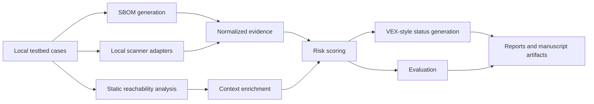

# SupplyTrace-VEX

SupplyTrace-VEX is a defensive, reproducible cybersecurity research artifact for context-aware software supply-chain vulnerability prioritization. It combines local testbed generation, SBOM evidence, scanner execution metadata, normalized findings, static dependency reachability, project context, risk scoring, VEX-style status generation, evaluation, and paper-ready reporting.

The repository is designed for applied research and artifact review. It does not scan or attack third-party systems, and it does not fabricate scanner output, vulnerability findings, labels, metrics, expert reviews, or performance claims.

## Research Problem

Software projects often depend on large dependency graphs, and vulnerability scanners can produce alert lists that are hard to prioritize without local project context. A scanner may report that a package version is associated with a vulnerability, but the project still needs evidence about whether the dependency is runtime or development-only, direct or transitive, statically imported, container-related, exposed, fixed, or missing enough evidence for a status decision.

SupplyTrace-VEX studies this problem using generated local testbed cases and reproducible artifacts. The goal is not to prove exploitability. The goal is to evaluate whether combining scanner evidence with local context can support more transparent vulnerability prioritization.

## Why Raw Scanners Are Not Enough

Raw scanner output is necessary evidence, but it is not a complete prioritization model. Scanner output can omit local reachability, dependency scope, runtime exposure, project-specific actionability labels, and cross-scanner disagreement. It can also be unavailable when a tool is not installed or has no local database access.

SupplyTrace-VEX preserves scanner output as evidence and then adds local context. Missing scanner tools are recorded as unavailable. Missing fields are represented as `null`, `unknown`, or explicit warnings. The pipeline does not fill gaps with invented data.

## Main Contributions

- A modular Python 3.11 research pipeline for local software supply-chain vulnerability prioritization.
- Deterministic 50-case local testbed generation with project-context ground truth labels.
- Manifest-derived internal fallback SBOM generation, with CycloneDX/SPDX files only when real external tool output is available.
- Local-only scanner adapters for OSV-Scanner, Trivy, Grype, npm audit, and pip-audit.
- A normalized scanner finding schema with missing-field warnings and raw evidence references.
- Static Python and JavaScript reachability analysis over local source code.
- Configurable contextual risk scoring and baseline rankings.
- Evidence-based VEX-style status generation that is not represented as official vendor VEX.
- Evaluation outputs for precision/recall/F1, top-k actionability, NDCG, MAP, scanner overlap, ablations, runtime, and evidence completeness when supporting data exists.
- Markdown, HTML, table CSV, figure-data, and manuscript-support artifacts for reproducible research reporting.

## System Architecture



The implementation keeps each stage separate so that generated claims can be traced to files under `artifacts/`, `testbed/ground_truth/`, or `docs/`.

## Installation

Use Python 3.11.

```bash
python -m venv .venv
source .venv/bin/activate
python -m pip install --upgrade pip
python -m pip install -e ".[dev]"
# Optional Python scanner/SBOM helper CLIs:
python -m pip install -e ".[dev,tools]"
```

On Windows PowerShell:

```powershell
python -m venv .venv
.\.venv\Scripts\Activate.ps1
python -m pip install --upgrade pip
python -m pip install -e ".[dev]"
# Optional Python scanner/SBOM helper CLIs:
python -m pip install -e ".[dev,tools]"
```

Check the CLI:

```bash
python -m supplytrace --help
```

External scanners are optional. The pipeline still runs when they are unavailable, but it records the missing tools in scanner and audit artifacts.

## Docker Usage

Build the image:

```bash
docker compose build
```

Run the full local pipeline:

```bash
docker compose run --rm run-all
```

Run a single command:

```bash
docker compose run --rm report
```

Set `RUN_ID=<id>` to reuse a stable run ID. `npm audit` scans only local package-lock files and queries the npm advisory service by default; set `SUPPLYTRACE_NPM_AUDIT_OFFLINE=true` only for cached offline npm-audit experiments. Set `SUPPLYTRACE_ALLOW_NETWORK_SCANNER_UPDATES=true` only when other scanner database updates are allowed by the review protocol. The compose file mounts `./artifacts`, `./testbed`, and `./docs` so generated evidence remains available on the host.

## Full Pipeline Command

```bash
python -m supplytrace run-all --run-id paper-repro-001
```

`run-all` executes the local pipeline in order: build testbed, generate SBOMs, run local scanners, normalize findings, analyze reachability, score, generate VEX-style statuses, evaluate, report, evidence-readiness check, and audit tool versions.

## Individual CLI Commands

```bash
python -m supplytrace build-testbed
python -m supplytrace generate-sbom --run-id local-run
python -m supplytrace run-scans --run-id local-run
python -m supplytrace normalize --run-id local-run
python -m supplytrace analyze-reachability --run-id local-run
python -m supplytrace score --run-id local-run
python -m supplytrace generate-vex --run-id local-run
python -m supplytrace evaluate --run-id local-run
python -m supplytrace report --run-id local-run
python -m supplytrace debug-evidence --run-id local-run
python -m supplytrace evidence-check --run-id local-run
python -m supplytrace audit --run-id local-run
```

`report` writes both Markdown and HTML reports, paper-ready tables, figure-ready data, and `docs/manuscript_support.md`. `debug-evidence` explains scanner success counts, raw output counts, parser counts, and the reason a finding set is empty. `evidence-check` decides whether generated artifacts can support paper-result claims; if normalized findings are zero, readiness is capped at 5/10 and paper-result claims are marked unsupported.

## Output Artifact Explanation

- `testbed/cases/case_001` through `case_050`: deterministic local testbed cases.
- `testbed/ground_truth/ground_truth.csv`: intended project-context labels, not scanner-confirmed vulnerability truth.
- `artifacts/sbom/internal`: internal fallback SBOMs derived from local manifests.
- `artifacts/sbom/syft`, `artifacts/sbom/cyclonedx`, and `artifacts/sbom/spdx`: real external SBOM output only when the external tool produced valid output.
- `artifacts/sbom/sbom_generation_metadata.csv` and `artifacts/sbom/sbom_tool_summary.csv`: SBOM generation status, completeness, and tool availability.
- `artifacts/scanner_raw/<scanner>`: raw scanner JSON, stdout, stderr, and metadata from local scanner runs.
- `artifacts/scanner_raw/scanner_execution_metadata.csv`: one row per scanner and case, including unavailable and skipped records.
- `artifacts/scanner_raw/scanner_summary.csv`: scanner status counts by scanner and ecosystem.
- `artifacts/normalized/findings_normalized.csv`: normalized scanner-backed findings.
- `artifacts/normalized/normalization_warnings.csv`: missing-field and parsing warnings.
- `artifacts/normalized/parser_coverage_summary.csv`: parser coverage and parsed finding counts per scanner.
- `artifacts/reachability/reachability_matrix.csv`: static dependency reachability and source evidence.
- `artifacts/reachability/context_enrichment.csv`: runtime, development, direct, transitive, container, exposure, and fix-availability context fields.
- `artifacts/evaluation/risk_scores.csv`: contextual actionability scores for normalized findings.
- `artifacts/evaluation/scoring_warnings.csv`: missing-evidence and zero-finding scoring warnings.
- `artifacts/evaluation/baseline_rankings.csv`: baseline ranking data used for comparison.
- `artifacts/evaluation/metrics_summary.csv`: evaluation metrics when labels and scanner-backed findings support them.
- `artifacts/evaluation/evaluation_notes.md`: missing-data notes and interpretation boundaries.
- `artifacts/vex/<case_id>.vex.json`: per-case VEX-style project evidence documents.
- `artifacts/vex/vex_summary.csv`: tabular VEX-style record summary.
- `artifacts/vex/vex_generation_warnings.csv`: VEX-style zero-finding or weak-evidence warnings.
- `artifacts/reports/report.md` and `artifacts/reports/report.html`: human-readable run reports.
- `artifacts/reports/tables`: paper-ready table CSV files.
- `artifacts/figures_data`: Mermaid diagrams and figure-ready CSV files.
- `artifacts/audit/evidence_readiness_report.md`: evidence gate for paper-result claims.
- `artifacts/audit/publication_readiness_score.csv`: publication artifact readiness score.
- `artifacts/audit/<run_id>/tool_versions.json`: local tool version capture.

## Reproducibility Instructions

For a clean reproducibility run:

```bash
python -m supplytrace run-all --run-id repro-001
python -m supplytrace report --run-id repro-001
python -m supplytrace evidence-check --run-id repro-001
python -m supplytrace audit --run-id repro-001
python -m pytest
```

Use a stable `--run-id` when preparing a paper artifact so report paths and audit files can be cited. Inspect `artifacts/evaluation/evaluation_notes.md` before making any claim about prioritization behavior. If metrics are marked `not_available`, the repository did not generate enough evidence for that metric in the current run.

Scoring weights can be overridden with `SUPPLYTRACE_SCORING_WEIGHTS_FILE`, which should point to a JSON file containing only supported weight keys.

## Tool Availability Behavior

External tools are not silently assumed. If `osv-scanner`, `trivy`, `grype`, `npm`, `pip-audit`, or `syft` are missing, SupplyTrace-VEX writes unavailable metadata and does not create fake outputs. Scanner failures are also recorded with stdout/stderr paths and execution metadata.

Scanner commands are blocked if arguments look like remote targets. The intended targets are local generated case directories and local Docker images only.

See `docs/scanner_installation.md` for local and Docker scanner installation guidance.

## Safety and Ethics Scope

SupplyTrace-VEX is defensive-only.

- Do not scan third-party systems.
- Do not probe package registries, public applications, or organization infrastructure as targets.
- Do not add exploit payloads, malware, credential harvesting, persistence, or offensive automation.
- Do not present generated VEX-style statuses as vendor attestations.
- Do not represent synthetic local cases as measurements from real organizations.

See `docs/ethics.md` for the full responsible-use statement.

## Limitations

- Static reachability can miss dynamic imports, reflection, generated code, framework dispatch, and runtime configuration.
- Scanner results depend on installed tools, local execution behavior, and database freshness.
- The testbed is synthetic and controlled; it supports reproducible method evaluation but does not represent the full diversity of production systems.
- Internal fallback SBOMs are manifest-derived and do not replace production SBOM tooling.
- VEX-style statuses are project-evidence records and are not official vendor-certified VEX documents.
- Metrics are reported only when generated artifacts support them. Missing metrics should not be described as improvement.

## How To Cite

Use `CITATION.cff` when citing this artifact. Until a DOI or archival release exists, cite the repository version, commit hash, release tag if available, and the run ID used to generate artifacts.

Example:

```text
SupplyTrace-VEX contributors. SupplyTrace-VEX: Context-Aware Software Supply-Chain Vulnerability Prioritization. Version 0.1.0, 2026.
```

## License

SupplyTrace-VEX is released under the MIT License. See `LICENSE`.

## Troubleshooting

- `python -m supplytrace --help` fails: confirm the package is installed with `python -m pip install -e ".[dev]"` and that Python 3.11 is active.
- Scanner rows show `unavailable`: install the scanner locally or cite the unavailable-tool metadata as part of the run.
- No normalized findings are produced: inspect `artifacts/scanner_raw/scanner_execution_metadata.csv` and raw scanner outputs. Do not add synthetic findings.
- Evaluation metrics show `not_available`: there were no labeled scanner-backed findings for that metric.
- Docker cannot write artifacts: confirm the `artifacts` and `testbed` directories are writable on the host.
- Report files are missing: run `python -m supplytrace report --run-id <id>` after generating pipeline artifacts.
- CI fails locally but not in Docker: compare Python versions and rerun `python -m pytest`.
