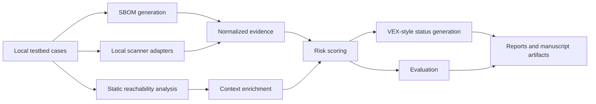

```mermaid
flowchart LR
  A["Local testbed cases"] --> B["SBOM generation"]
  A --> C["Local scanner adapters"]
  A --> D["Static reachability analysis"]
  B --> E["Normalized evidence"]
  C --> E
  D --> F["Context enrichment"]
  E --> G["Risk scoring"]
  F --> G
  G --> H["VEX-style status generation"]
  G --> I["Evaluation"]
  H --> J["Reports and manuscript artifacts"]
  I --> J
```
