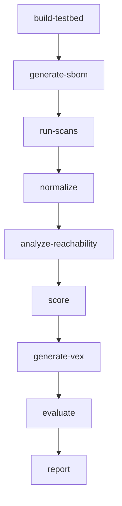

```mermaid
flowchart TD
  T["build-testbed"] --> S["generate-sbom"]
  S --> R["run-scans"]
  R --> N["normalize"]
  N --> A["analyze-reachability"]
  A --> P["score"]
  P --> V["generate-vex"]
  V --> E["evaluate"]
  E --> O["report"]
```
